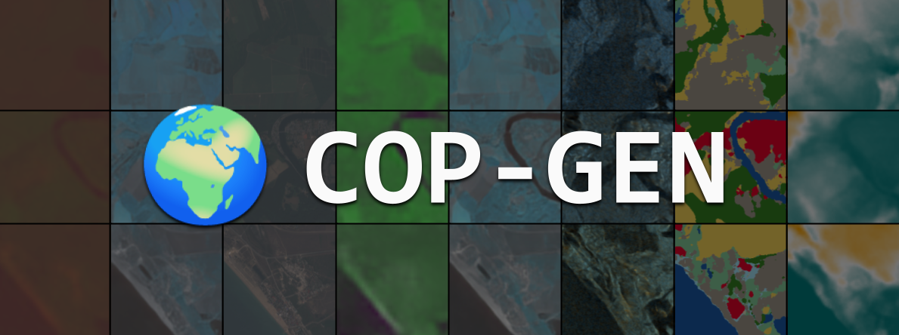

# 🌍 COP-GEN: Latent Diffusion Transformer for Copernicus Earth Observation Data -- Generation Stochastic by Design.

[](https://huggingface.co/spaces/mikonvergence/COP-GEN)
[](https://github.com/mespinosami/COP-GEN)
[](https://miquel-espinosa.github.io/cop-gen/)
[](https://huggingface.co/mespinosami/copgen-base)
[](https://huggingface.co/datasets/mespinosami/copgen-edinburgh-subset)
[](https://huggingface.co/collections/mespinosami/copgen)

---

### 📋 Table of Contents

- [🚀 Getting Started](#-getting-started)
  - [1. Setup](#1-setup)
  - [2. Download Pretrained Models and Example Dataset](#2-download-pretrained-models-and-example-dataset)
- [🔮 Using COP-GEN (Inference)](#-using-cop-gen-inference)
  - [Conditional Generation](#conditional-generation)
  - [Unconditional Generation](#unconditional-generation)
- [🏋️ Training COP-GEN](#️-training-cop-gen)
  - [1. Create Your Own Dataset (Optional)](#1-optional-create-your-own-dataset-from-scratch)
  - [2. VAE Training](#2-vae)
  - [3. Training COP-GEN Diffusion Backbone](#3-training-cop-gen-diffusion-backbone)
  - [4. Evaluation](#4-evaluation)
- [📖 Citation](#-citation)

---

# 🚀 Getting Started

## 1. Setup

### 1.1. Clone the repository

```bash
git clone https://github.com/mespinosami/COP-GEN.git
cd COP-GEN
```

### 1.2. Create a virtual environment and install the dependencies

```bash
conda create -n cop-gen python=3.11 -y
conda activate cop-gen
pip install -r requirements.txt
```

### 1.3. Set the PYTHONPATH to include the current directory

```bash
export PYTHONPATH=$PYTHONPATH:$(pwd)
```

### 1.4. Folder setup

Data will be stored in `./data/`. Models will be stored in `./models/`. Create symlinks if you need.
```bash
ln -s /path/to/disk/with/storage/ ./data
ln -s /path/to/disk/with/storage/ ./models
```

## 2. Download pretrained models and example dataset

### 2.1. Download VAE models 🎯

```bash
git clone https://huggingface.co/mespinosami/copgen-vaes ./models/vae
rm -rf ./models/vae/.git
rm -rf ./models/vae/.gitattributes
```

### 2.2. Download COP-GEN model 🧠

```bash
git clone https://huggingface.co/mespinosami/copgen-base ./models/copgen/cop_gen_base
rm -rf ./models/copgen/cop_gen_base/.git
rm -rf ./models/copgen/cop_gen_base/.gitattributes
```

### 2.3. Download example pre-compiled dataset (Edinburgh 🏰)

We provide the already processed dataset for Edinburgh subset in Hugging Face: https://huggingface.co/datasets/mespinosami/copgen-edinburgh-subset.
You can download it by running the following command:

```bash
git clone https://huggingface.co/datasets/mespinosami/copgen-edinburgh-subset ./data/majorTOM/edinburgh
for f in ./data/majorTOM/edinburgh/*.zip; do
    unzip -q "$f" -d ./data/majorTOM/edinburgh/
done
rm ./data/majorTOM/edinburgh/*.zip
rm -rf ./data/majorTOM/edinburgh/.git
rm -rf ./data/majorTOM/edinburgh/.gitattributes
```

---

# 🔮 Using COP-GEN (Inference)

Using COP-GEN could not be easier. Just run the following example:

```python
from libs.copgen import CopgenModel

model = CopgenModel(model_path="path/to/model_checkpoint.pth", config_path="path/to/model_config.py")

print(model.input_resolutions) # print modality names and expected input resolutions

samples = model.generate(
      modalities=["modality_name_1", "modality_name_2", ...],      # modalities to generate (required)
      conditions={"modality_name_1": modality_name_1_tensor,       # conditioning tensors for each modality (optional)
                  "modality_name_2": modality_name_2_tensor, ...},
      n_samples=4,                                                 # number of samples to generate per condition
      return_latents=False                                         # return latents too? (optional)
    )
```

### Conditional Generation

For a more detailed example, see the `examples/conditional_generation.py` script: a complete, easy-to-follow example that demonstrates how to use COP-GEN for all possible modalities and conditions.


```bash
# Script is self-explanatory: read the comments in the main() function.
python examples/conditional_generation.py
```

Generated outputs are always saved in the `./<subset_data_folder>/outputs` folder

```bash
Example output folder structure:
./data/majorTOM/edinburgh/outputs/conditional_example
├── generations/
│   ├── lat_lon.csv
│   ├── LULC_LULC/
│   ├── S2L1C_B01_B09_B10/
│   ├── S2L1C_B02_B03_B04_B08/
│   ├── S2L1C_B05_B06_B07_B11_B12_B8A/
│   ├── S2L1C_cloud_mask/
│   ├── S2L2A_B01_B09/
│   ├── S2L2A_B02_B03_B04_B08/
│   ├── S2L2A_B05_B06_B07_B11_B12_B8A/
│   └── timestamp.csv
└── visualisations/
    ├── 3d_cartesian_lat_lon/
    ├── DEM_DEM/
    ├── LULC_LULC/
    ├── mean_timestamps/
    ├── merged_visualisations/ # useful for visualising all at once
    ├── S1RTC_vh_vv/
    ├── S2L1C_B01_B09_B10/
    ├── S2L1C_B02_B03_B04_B08/
    ├── S2L1C_B05_B06_B07_B11_B12_B8A/
    ├── S2L1C_cloud_mask/
    ├── S2L2A_B01_B09/
    ├── S2L2A_B02_B03_B04_B08/
    └── S2L2A_B05_B06_B07_B11_B12_B8A/
```


### Unconditional Generation

For an unconditional generation example, see the `examples/unconditional_generation.py` script:
```bash
python examples/unconditional_generation.py
```

---

# 🏋️ Training COP-GEN

### 1. (Optional) Create your own dataset from scratch

To facilitate rapid development, we provide a pre-compiled small dataset for Edinburgh. See section [Download example pre-compiled dataset (Edinburgh 🏰)](#23-download-example-pre-compiled-dataset-edinburgh-🏰) for more details.

<details>
<summary>🔧 (Click to expand) If you want to <b>create the dataset from scratch</b>, you can follow the steps below</summary>


**Select a subset of data to download.**

In this case, we will download the region of Edinburgh. The script will download the parquet files and extract the tif files corresponding to the defined region.

```bash
# Note: LULC modality is currently missing in MajorTOM
sh slurm/download/download_edinburgh_parquets.sh
```

**Create pkl files with the precomputed data paths.**

```bash
python3 scripts/create_pkl_files.py --root_dir ./data/majorTOM/edinburgh --modalities DEM S2L1C S2L2A S1RTC LULC
```
</details>

## 2. VAE

### 2.1. Compute min-max statistics for input normalisation 📊

<details>
<summary>Click to expand: Computing min-max statistics (optional)</summary>

> **Note:** This step is optional if you're using the provided config files, as the min-max values are already precomputed and included in them.

VAE works best when the input is normalised to [-1, 1]. We need to compute the min-max statistics for each modality. Run the command below and update the corresponding config files with the computed min-max values.

```bash
# S1RTC
python3 scripts/compute_min_max.py --cfg configs/vae/final/S1RTC/copgen_ae_kl_192x192_S1RTC_VV_VH_latent_8.yaml --data_dir ./data/majorTOM/edinburgh/Core-S1RTC

# DEM
python3 scripts/compute_min_max.py --cfg configs/vae/final/DEM/copgen_ae_kl_64x64_DEM_DEM_latent_8.yaml --data_dir ./data/majorTOM/edinburgh/Core-DEM

# For DEM we can use
# - min_db = np.log1p(0.000001) # Minimum height
# - max_db = np.log1p(8849) # Everest height
# - min_positive = 5.899129519093549e-06 # Minimum positive value

# S2L2A: We don't need this for S2 since we apply fixed scaling factor of 1000 to the data.
```
</details>

### 2.2. Create train/test split ✂️

Create the train/test split using the flag `--create_train_test` and passing any of the config files in `configs/vae/final/`.

```bash
python3 encode_moments_vae.py \
    --cfg configs/vae/final/S2L2A/copgen_ae_kl_192x192_S2L2A_B4_3_2_8_latent_8.yaml \
    --data_dir ./data/majorTOM/edinburgh/Core-S2L2A \
    --output_dir ./data/majorTOM/edinburgh/latents \
    --patchify \
    --lulc_align \
    --create_train_test
```

Check that the train/test split files have been created in the output directory.

```bash
ls -l ./data/majorTOM/edinburgh/latents/train.txt
ls -l ./data/majorTOM/edinburgh/latents/test.txt
```

### 2.2. Train a separate VAE for each modality 🎨

Now that the dataset is prepared, we can train a separate VAE for each modality.

Slurm training scripts can be found in `./slurm/vae/train/<modality>/<config_file>.sh`.

Results (checkpoints and visualisations) will be stored in the `./results` folder. To resume training, just rerun the same command with the same config file.

```bash
mkdir -p ./results
```

Update the batch size in the config files according to the available memory.

<details>
<summary><b>🏔️ DEM (Band DEM) - 64x64 resolution</b></summary>

```bash
accelerate launch --num_processes 1 train_vae.py \
    --cfg ./configs/vae/final/DEM/copgen_ae_kl_64x64_DEM_DEM_latent_8.yaml \
    --data_dir ./data/majorTOM/edinburgh/Core-DEM
```

</details>

<details>
<summary><b>🗺️ LULC (Band LULC) - 192x192 resolution</b></summary>

```bash
accelerate launch --num_processes 1 train_vae.py \
    --cfg ./configs/vae/final/LULC/copgen_ae_kl_192x192_LULC_LULC_latent_8.yaml \
    --data_dir ./data/majorTOM/edinburgh/Core-LULC
```

</details>


</details>

<details>
<summary><b>☁️ CLOUD_MASK (Band CLOUD_MASK, from S2L1C bands) - 192x192 resolution</b></summary>

```bash
accelerate launch --num_processes 1 train_vae.py \
    --cfg ./configs/vae/final/cloud_mask/copgen_ae_kl_192x192_S2L1C_cloud_mask_latent_8.yaml \
    --data_dir ./data/majorTOM/edinburgh/Core-S2L1C
```

</details>


<details>
<summary><b>📡 S1RTC (Bands VV and VH) - 192x192 resolution</b></summary>

```bash
accelerate launch --num_processes 1 train_vae.py \
    --cfg ./configs/vae/final/S1RTC/copgen_ae_kl_192x192_S1RTC_VV_VH_latent_8.yaml \
    --data_dir ./data/majorTOM/edinburgh/Core-S1RTC
```

</details>


<details>
<summary><b>🛰️ S2L1C (Bands B01, B09, B10) - 32x32 resolution</b></summary>

```bash
accelerate launch --num_processes 1 train_vae.py \
    --cfg ./configs/vae/final/S2L1C/copgen_ae_kl_32x32_S2L1C_B1_9_10_latent_8.yaml \
    --data_dir ./data/majorTOM/edinburgh/Core-S2L1C
```

</details>


<details>
<summary><b>🛰️ S2L1C (Bands B05, B06, B07, B8A, B11, B12) - 96x96 resolution</b></summary>

```bash
accelerate launch --num_processes 1 train_vae.py \
    --cfg ./configs/vae/final/S2L1C/copgen_ae_kl_96x96_S2L1C_B5_6_7_8A_11_12_latent_8.yaml \
    --data_dir ./data/majorTOM/edinburgh/Core-S2L1C
```

</details>


<details>
<summary><b>🛰️ S2L1C (Bands B02, B03, B04, B08) - 192x192 resolution</b></summary>

```bash
accelerate launch --num_processes 1 train_vae.py \
    --cfg ./configs/vae/final/S2L1C/copgen_ae_kl_192x192_S2L1C_B4_3_2_8_latent_8.yaml \
    --data_dir ./data/majorTOM/edinburgh/Core-S2L1C
```

</details>


<details>
<summary><b>🌍 S2L2A (Bands B01, B09) - 32x32 resolution</b></summary>

```bash
accelerate launch --num_processes 1 train_vae.py \
    --cfg ./configs/vae/final/S2L2A/copgen_ae_kl_32x32_S2L2A_B1_9_latent_8.yaml \
    --data_dir ./data/majorTOM/edinburgh/Core-S2L2A
```

</details>


<details>
<summary><b>🌍 S2L2A (Bands B05, B06, B07, B8A, B11, B12) - 96x96 resolution</b></summary>

```bash
accelerate launch --num_processes 1 train_vae.py \
    --cfg ./configs/vae/final/S2L2A/copgen_ae_kl_96x96_S2L2A_B5_6_7_8A_11_12_latent_8.yaml \
    --data_dir ./data/majorTOM/edinburgh/Core-S2L2A
```

</details>


<details>
<summary><b>🌍 S2L2A (Bands B02, B03, B04, B08) - 192x192 resolution</b></summary>

```bash
accelerate launch --num_processes 1 train_vae.py \
    --cfg ./configs/vae/final/S2L2A/copgen_ae_kl_192x192_S2L2A_B4_3_2_8_latent_8.yaml \
    --data_dir ./data/majorTOM/edinburgh/Core-S2L2A
```

</details>

<br>

<details>
<summary>⚡ (Optional) Training VAEs with multiple GPUs</summary>

Use the following example to train the VAE with multiple GPUs:

```bash
# Export necessary environment variables for distributed training
export MASTER_ADDR=$(hostname)
export MASTER_PORT=12804
export WORLD_SIZE=4  # Total number of GPUs
export NODE_RANK=0   # This node's rank (0 since it's a single node)

accelerate launch \
    --main_process_port $MASTER_PORT \
    --num_processes $WORLD_SIZE \
    --multi_gpu \
    train_vae.py \
        --cfg ./configs/vae/final/<modality>/<config_file>.yaml \
        --data_dir ./data/majorTOM/edinburgh/Core-<modality>
```

</details>

<br>


Copy all the final trained VAE checkpoints to the `./models/vae` folder for better organization.

```bash
# For all modalities, manually copy the checkpoints to the `./models/vae/<modality>/<config_file>` folder.
cp ./results/<modality>/<config_file>/model-*.pt ./models/vae/<modality>/<config_file>/model-*.pt
```


### 2.3. Encode dataset with pretrained VAEs into latents 🔢

Slurm scripts can be found in `./slurm/encode/<modality>/<config_file>.sh`.

For each modality we have to run the script (with the appropriate config file and checkpoint path).

```bash
ROOT_PATH="./data/majorTOM/edinburgh"
LATENTS_PATH="./data/majorTOM/edinburgh/latents"
```

<details>
<summary><b>🏔️ Encode DEM</b></summary>

```bash
accelerate launch --num_processes 1 encode_moments_vae.py \
  --cfg ./configs/vae/final/DEM/copgen_ae_kl_64x64_DEM_DEM_latent_8.yaml \
  --data_dir ${ROOT_PATH}/Core-DEM \
  --checkpoint_path ./models/vae/DEM_64x64_DEM_latent_8/model-50.pt \
  --output_dir ${LATENTS_PATH} \
  --batch_size 64 \
  --patchify \
  --latents_only \
  --num_workers 32 \
  --lulc_align \
  --save_to_lmdb --lmdb_fast --flush_every_batches 32
```

</details>

<details>
<summary><b>🗺️ Encode LULC</b></summary>

```bash
accelerate launch --num_processes 1 encode_moments_vae.py \
  --cfg ./configs/vae/final/LULC/copgen_ae_kl_192x192_LULC_LULC_latent_8.yaml \
  --data_dir ${ROOT_PATH}/Core-LULC \
  --checkpoint_path ./models/vae/LULC_192x192_LULC_latent_8/model-50.pt \
  --output_dir ${LATENTS_PATH} \
  --batch_size 64 \
  --patchify \
  --latents_only \
  --num_workers 32 \
  --lulc_align \
  --save_to_lmdb --lmdb_fast --flush_every_batches 32
```

</details>


<details>
<summary><b>☁️ Encode Cloud-cover</b></summary>

```bash
accelerate launch --num_processes 1 encode_moments_vae.py \
  --cfg ./configs/vae/final/cloud_mask/copgen_ae_kl_192x192_S2L1C_cloud_mask_latent_8.yaml \
  --data_dir ${ROOT_PATH}/Core-S2L1C \
  --checkpoint_path ./models/vae/S2L1C_192x192_cloud_mask_latent_8/model-50.pt \
  --output_dir ${LATENTS_PATH} \
  --batch_size 64 \
  --patchify \
  --latents_only \
  --num_workers 32 \
  --lulc_align \
  --save_to_lmdb --lmdb_fast --flush_every_batches 32
```

</details>


<details>
<summary><b>📡 Encode S1RTC</b></summary>

```bash
accelerate launch --num_processes 1 encode_moments_vae.py \
  --cfg ./configs/vae/final/S1RTC/copgen_ae_kl_192x192_S1RTC_VV_VH_latent_8.yaml \
  --data_dir ${ROOT_PATH}/Core-S1RTC \
  --checkpoint_path ./models/vae/S1RTC_192x192_VV_VH_latent_8/model-50.pt \
  --output_dir ${LATENTS_PATH} \
  --batch_size 64 \
  --patchify \
  --latents_only \
  --num_workers 32 \
  --lulc_align \
  --save_to_lmdb --lmdb_fast --flush_every_batches 32
```

</details>


<details>
<summary><b>🛰️ Encode S2L1C (Bands B01, B09, B10)</b></summary>

```bash
accelerate launch --num_processes 1 encode_moments_vae.py \
  --cfg ./configs/vae/final/S2L1C/copgen_ae_kl_32x32_S2L1C_B1_9_10_latent_8.yaml \
  --data_dir ${ROOT_PATH}/Core-S2L1C \
  --checkpoint_path ./models/vae/S2L1C_32x32_B1_9_10_latent_8/model-50.pt \
  --output_dir ${LATENTS_PATH} \
  --batch_size 128 \
  --patchify \
  --latents_only \
  --num_workers 32 \
  --lulc_align \
  --save_to_lmdb --lmdb_fast --flush_every_batches 32
```

</details>

<details>
<summary><b>🛰️ Encode S2L1C (Bands B05, B06, B07, B8A, B11, B12)</b></summary>

```bash
accelerate launch --num_processes 1 encode_moments_vae.py \
  --cfg ./configs/vae/final/S2L1C/copgen_ae_kl_96x96_S2L1C_B5_6_7_8A_11_12_latent_8.yaml \
  --data_dir ${ROOT_PATH}/Core-S2L1C \
  --checkpoint_path ./models/vae/S2L1C_96x96_B5_6_7_8A_11_12_latent_8/model-50.pt \
  --output_dir ${LATENTS_PATH} \
  --batch_size 64 \
  --patchify \
  --latents_only \
  --num_workers 32 \
  --lulc_align \
  --save_to_lmdb --lmdb_fast --flush_every_batches 32
```

</details>

<details>
<summary><b>🛰️ Encode S2L1C (Bands B02, B03, B04, B08)</b></summary>

```bash
accelerate launch --num_processes 1 encode_moments_vae.py \
  --cfg ./configs/vae/final/S2L1C/copgen_ae_kl_192x192_S2L1C_B4_3_2_8_latent_8.yaml \
  --data_dir ${ROOT_PATH}/Core-S2L1C \
  --checkpoint_path ./models/vae/S2L1C_192x192_B4_3_2_8_latent_8/model-50.pt \
  --output_dir ${LATENTS_PATH} \
  --batch_size 64 \
  --patchify \
  --latents_only \
  --num_workers 32 \
  --lulc_align \
  --save_to_lmdb --lmdb_fast --flush_every_batches 32
```

</details>


<details>
<summary><b>🌍 Encode S2L2A (Bands B01, B09)</b></summary>

```bash
accelerate launch --num_processes 1 encode_moments_vae.py \
  --cfg ./configs/vae/final/S2L2A/copgen_ae_kl_32x32_S2L2A_B1_9_latent_8.yaml \
  --data_dir ${ROOT_PATH}/Core-S2L2A \
  --checkpoint_path ./models/vae/S2L2A_32x32_B1_9_latent_8/model-50.pt \
  --output_dir ${LATENTS_PATH} \
  --batch_size 128 \
  --patchify \
  --latents_only \
  --num_workers 32 \
  --lulc_align \
  --save_to_lmdb --lmdb_fast --flush_every_batches 32
```

</details>


<details>
<summary><b>🌍 Encode S2L2A (Bands B05, B06, B07, B8A, B11, B12)</b></summary>

```bash
accelerate launch --num_processes 1 encode_moments_vae.py \
  --cfg ./configs/vae/final/S2L2A/copgen_ae_kl_96x96_S2L2A_B5_6_7_8A_11_12_latent_8.yaml \
  --data_dir ${ROOT_PATH}/Core-S2L2A \
  --checkpoint_path ./models/vae/S2L2A_96x96_B5_6_7_8A_11_12_latent_8/model-50.pt \
  --output_dir ${LATENTS_PATH} \
  --batch_size 64 \
  --patchify \
  --latents_only \
  --num_workers 32 \
  --lulc_align \
  --save_to_lmdb --lmdb_fast --flush_every_batches 32
```

</details>


<details>
<summary><b>🌍 Encode S2L2A (Bands B02, B03, B04, B08)</b></summary>

```bash
accelerate launch --num_processes 1 encode_moments_vae.py \
  --cfg ./configs/vae/final/S2L2A/copgen_ae_kl_192x192_S2L2A_B4_3_2_8_latent_8.yaml \
  --data_dir ${ROOT_PATH}/Core-S2L2A \
  --checkpoint_path ./models/vae/S2L2A_192x192_B4_3_2_8_latent_8/model-50.pt \
  --output_dir ${LATENTS_PATH} \
  --batch_size 64 \
  --patchify \
  --latents_only \
  --num_workers 32 \
  --lulc_align \
  --save_to_lmdb --lmdb_fast --flush_every_batches 32
```

</details>


### 2.4. Merge LMDB latents into a single LMDB 🔗

```bash
mkdir -p ./data/majorTOM/edinburgh/latents_merged/train
mkdir -p ./data/majorTOM/edinburgh/latents_merged/test

python scripts/merge_lmdbs.py \
    --input_dir ./data/majorTOM/edinburgh/latents/train \
    --output_dir ./data/majorTOM/edinburgh/latents_merged/train \
    --batch_size 20000

python scripts/merge_lmdbs.py \
    --input_dir ./data/majorTOM/edinburgh/latents/test \
    --output_dir ./data/majorTOM/edinburgh/latents_merged/test \
    --batch_size 20000
```

### 2.5. Extract EMA model from .pt files 📦

To make the .pt files compatible with the codebase, we need to extract the ema model from the .pt files. Run the script:

```bash
sh ./slurm/extract_ema_models.sh
```

Or manually run for all checkpoints in the `./models/vae` directory:

```bash
python3 scripts/extract_ema_convert_model.py models/vae/<modality>/<config_file>/model-*.pt
```

<details>
<summary>📝 More details</summary>

This will create a new file with the same name as the original file, but with the -ema suffix, and will only contain the ema model `state_dict`, already converted to the correct format.

Note that the .pt file contains:
- `step`: `type=<class 'int'>`
- `model`: `type=<class 'collections.OrderedDict'>`
- `opt_ae`: `type=<class 'dict'>`
- `lr_scheduler_ae`: `type=<class 'dict'>`
- `opt_disc`: `type=<class 'dict'>`
- `lr_scheduler_disc`: `type=<class 'dict'>`
- `ema`: `type=<class 'collections.OrderedDict'>`
- `scaler`: `type=<class 'NoneType'>`

</details>

### 2.6. Compute scaling factor (VAE-specific magic number) ⚖️

To ensure that the input to the diffusion model has approximately unit variance, we need to compute the scaling factor for each autoencoder model. This scaling factor is specified in the `scale_factor` for each autoencoder model in the config files.

To find out the scaling factor, we need to run the following command (example for Edinburgh):

```bash
python scripts/compute_scaling_factor_simplified.py \
  --latent_path ./data/majorTOM/edinburgh/latents/train \
  --config_path ./configs/copgen/discrete/demo_edinburgh.py \
  --grid_cells_file ./data/majorTOM/edinburgh/latents/train.txt \
  --num_samples 5000 \
  --batch_size 5000
```

This will compute the scaling factor for each modality and print it to the console. Make sure to copy the values and add them to the config file, in our case `configs/copgen/discrete/demo_edinburgh.py`.

Find the launch script in `slurm/compute_scaling_factors.sh`.


### 2.7. Precompute lat-lon and timestamps for each grid cell 🌐

**Extract common grid cells**

Save to txt file common grid cells. (Relevant CLI arguments are only `--output_dir` and `--save_common_grid_cells`).

```bash
accelerate launch --num_processes 1 encode_moments_vae.py \
  --cfg ./configs/vae/final/S2L2A/copgen_ae_kl_192x192_S2L2A_B4_3_2_8_latent_8.yaml \
  --data_dir ./data/majorTOM/edinburgh/Core-S2L2A \
  --output_dir ./data/majorTOM/edinburgh \
  --patchify \
  --lulc_align \
  --save_common_grid_cells common_grid_cells.txt
```

**Precompute lat-lon for each grid cell and patch_size**

```bash
python ./scripts/precompute_lat_lon.py \
    --grid_cells_txt ./data/majorTOM/edinburgh/common_grid_cells.txt \
    --patch_side 6 \
    --format 3d_cartesian \
    --storage npy_dir \
    --output ./data/majorTOM/edinburgh/3d_cartesian_lat_lon_cache \
    --workers 16
```

**Precompute time mean**

```bash
python3 ./scripts/precompute_time_mean.py \
    --s1_metadata ./data/majorTOM/edinburgh/Core-S1RTC/metadata.parquet \
    --s2_metadata ./data/majorTOM/edinburgh/Core-S2L2A/metadata.parquet \
    --grid_cells_txt ./data/majorTOM/edinburgh/common_grid_cells.txt \
    --output ./data/majorTOM/edinburgh/mean_timestamps_cache.pkl \
    --histogram ./data/majorTOM/edinburgh/mean_timestamps_diff.png
```


## 3. Training COP-GEN diffusion backbone 🧬


### 3.1. Training COP-GEN diffusion backbone

To train the COP-GEN diffusion backbone, run the following script (example for Edinburgh):

```bash
sh ./slurm/copgen/4gpu-demo-edinburgh.sh
```

The config file for this demo can be found in `./configs/copgen/discrete/demo_edinburgh.py`.

Results (checkpoints and visualisations) are stored in `./workdir/copgen/discrete/demo_edinburgh/default/`.


## 4. Evaluation 📈

Test set used for evaluation is available in Hugging Face: https://huggingface.co/datasets/mespinosami/copgen-test-dataset (495 images).

---

# 📖 Citation

If you find this work useful, please cite it as follows:

```bibtex
@inproceedings{espinosa2025copgen,
  title={},
  author={},
  booktitle={Conference},
  year={2025}
}
```
